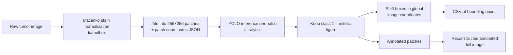

# Mitotic Figure Detection in H&E Tumor Images

A two-stage pipeline for detecting **mitotic figures** in H&E-stained histopathology images. Images are stain-normalized to a MIDOG reference, tiled into patches, run through a YOLOv8 detector trained on the [MIDOG](https://midog.deepmicroscopy.org/) dataset, and the detections are mapped back to whole-image coordinates.

<p align="center">
  
  <br/>
  <em>Stain-normalization target (MIDOG training patch <code>001_patch_200_4000.png</code>)</em>
</p>

---

## Pipeline Overview



### Stage 1 — Preprocessing (`preprocessing.py`)

1. **Stain normalization** — each source image is normalized with the **Macenko** method (`tiatoolbox.tools.stainnorm`) using a MIDOG training patch as the target. This reduces color variation between scanners and staining protocols so the images resemble the detector's training distribution.
2. **Patch extraction** — the normalized image is tiled into non-overlapping **256 × 256** patches. Edge patches are padded to full size. The top-left `(x, y)` of each patch is stored in a JSON file for later reconstruction.
3. **Parallel & resumable** — case folders are processed in parallel using all CPU cores (`multiprocessing.Pool`), and images that already have a `Patches/` directory are skipped.

### Stage 2 — Detection & Reconstruction (`ACS_Mitosis_Pred_recon_new.py`)

1. Runs a trained **YOLO** model (`ultralytics`) on every patch.
2. Keeps detections of **class index 1** (mitotic figure) and draws them in green on the patch.
3. Converts patch-level boxes to **whole-image coordinates** using the stored patch offsets.
4. Writes one **CSV of bounding boxes** per image.
5. **Reconstructs** the full normalized image from the annotated patches so all detections can be reviewed at once.

---

## Repository Structure

```
.
├── preprocessing.py                  # Stain normalization + patch extraction
├── ACS_Mitosis_Pred_recon_new.py     # YOLO inference, CSV export, image reconstruction
├── assets/
│   └── 001_patch_200_4000.png        # Stain-normalization target (MIDOG)
├── requirements.txt
└── README.md
```

---

## Installation

```bash
git clone https://github.com/<your-username>/<your-repo>.git
cd <your-repo>

python -m venv venv
source venv/bin/activate          # Windows: venv\Scripts\activate

pip install -r requirements.txt
```

**`requirements.txt`**

```
tiatoolbox
ultralytics
opencv-python
pillow
matplotlib
scikit-image
requests
```

> `tiatoolbox` may require system libraries such as OpenSlide. See the [tiatoolbox installation guide](https://tia-toolbox.readthedocs.io/en/latest/installation.html).

### Model weights

The trained detector weights (`best.pt`) are **not included** in this repository. Place your weights file somewhere accessible and update the path in `ACS_Mitosis_Pred_recon_new.py`:

```python
model = YOLO('path/to/best.pt')
```

---

## Input Data Layout

The preprocessing script expects one folder per case, each containing tumor image tiles:

```
TMC_new/
├── <case_1>/
│   └── tumor/
│       └── images/
│           ├── image_a.png
│           └── image_b.jpg
├── <case_2>/
│   └── tumor/
│       └── images/
│           └── ...
```

Supported formats: `.png`, `.jpg`, `.jpeg`.

---

## Configuration

Paths are currently set as constants inside the scripts. Update them to match your environment before running:

| Script | Variable | Purpose |
|---|---|---|
| `preprocessing.py` | `path_all` | Root folder containing the case folders |
| `preprocessing.py` | `target_image` | Stain-normalization target (e.g. `assets/001_patch_200_4000.png`) |
| `preprocessing.py` | `save_dir` / `patches_dir` | Output folder for normalized images and patches |
| `preprocessing.py` | `patch_size` | Patch size in pixels (default `256`) |
| `ACS_Mitosis_Pred_recon_new.py` | `model` path | YOLO weights (`best.pt`) |
| `ACS_Mitosis_Pred_recon_new.py` | `root_dir` | Output folder of the preprocessing step |
| `ACS_Mitosis_Pred_recon_new.py` | `output_base` | Where CSVs and reconstructed images are written |

> **Note:** `path_all` appears in two functions in `preprocessing.py`, and the output path appears in both `is_processed` and `stain_norm`. Keep them consistent.

---

## Usage

```bash
# 1. Normalize and tile all images
python preprocessing.py

# 2. Detect mitoses, export coordinates, and reconstruct annotated images
python ACS_Mitosis_Pred_recon_new.py
```

---

## Outputs

**After preprocessing**

```
PreProcessing/
└── <case>/tumor/images/<image_name>/
    ├── <image_name>.png                  # Stain-normalized image
    ├── patches_info_<image_name>.json    # Patch names and (x, y) offsets
    ├── Patches/                          # 256×256 patches
    └── Patches_detected/                 # Annotated patches (created in stage 2)
```

`patches_info_<image_name>.json` example:

```json
[
    {"patch_name": "patch_0", "x": 0,   "y": 0},
    {"patch_name": "patch_1", "x": 256, "y": 0}
]
```

**After detection**

```
TMC_new_Final_Outputs/
├── Final_Output/
│   └── <case>/<image_name>.csv                        # Mitosis bounding boxes
└── Outputs/
    └── <case>/img_<image_name>_norm_reconstructed.png # Full annotated image
```

CSV format (pixel coordinates in the normalized full image):

| top_left_x | top_left_y | bottom_right_x | bottom_right_y |
|---|---|---|---|
| 1043.2 | 518.7 | 1081.5 | 560.1 |

> Because edge patches are padded to 256 × 256, the reconstructed image may be slightly larger than the original, with black borders on the right and bottom edges. Box coordinates are unaffected.

---

## Notes & Limitations

- Patches are **non-overlapping**, so a mitotic figure lying on a patch border may be split or missed. Overlapping tiling with box merging (e.g. NMS) would address this.
- Only class `1` is exported; adjust the class filter if your model uses a different label mapping.
- Detection uses the Ultralytics default confidence threshold. Pass `conf=` to `model(...)` to tune it.

---

## Acknowledgements

- [MIDOG Challenge](https://midog.deepmicroscopy.org/) — training data and stain reference
- [TIAToolbox](https://github.com/TissueImageAnalytics/tiatoolbox) — Macenko stain normalization
- [Ultralytics YOLO](https://github.com/ultralytics/ultralytics) — object detection

## License

This project is licensed under the **GNU Affero General Public License v3.0 (AGPL-3.0)**. See the [LICENSE](LICENSE) file for details.

In short, you may use, modify, and share this code, but any distributed or network-deployed version, including modified versions, must also be released under AGPL-3.0 with its full source code available.

The detector is built on [Ultralytics YOLOv8](https://github.com/ultralytics/ultralytics), which is licensed under AGPL-3.0 (or a paid Ultralytics Enterprise License). This project follows the same open-source license.

## Citation

If you use this work in your research, please cite:

```bibtex
@misc{your_name_2026_mitosis,
  author = {Sahar Almahfouz Nasser},
  title  = {Mitotic Figure Detection in H\&E Tumor Images},
  year   = {2026},
  url    = {https://github.com/SaharAlmahfouzNasser/Mitosis-Detection.git}
}
```
